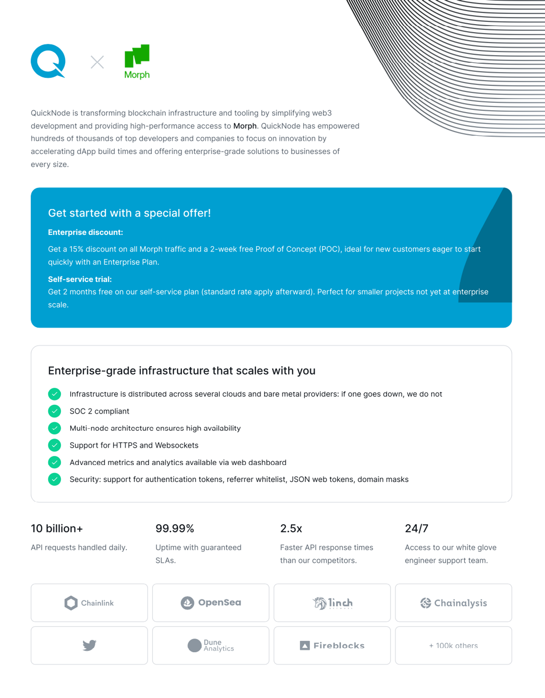

En plus des outils et ressources officiels, nous avons également établi des partenariats avec d'autres projets d'infrastructure pour aider les constructeurs sur Morph. Voici la liste des projets qui sont en ligne sur le testnet Holesky de Morph.

:::tip Plus de partenaires à venir bientôt

Comme Morph est encore en phase de test bêta, nous travaillons en étroite collaboration pour compléter les coopérations d'infrastructure, afin d'assurer des instructions claires. Les partenaires qui travaillent encore sur l'intégration du testnet Holesky ne sont pas listés, nous mettrons à jour cette page.
:::

<!--
### Ponts de 3ème Partie

[LayerZero]()

[Orbiter Finance]()

[Axelar]()
-->

### Services RPC

#### Quicknode

QuickNode transforme l'infrastructure et les outils blockchain en simplifiant le développement web3 et en fournissant un accès haute performance à Morph.

Les développeurs de l'écosystème Morph sont maintenant éligibles pour des crédits/remises QuickNode gratuits !

Lisez-en plus sur ce que vous pouvez obtenir ici :

[Partenariat Quicknode](https://quicknode.notion.site/QuickNode-Benefits-for-Morph-Developers-4baf42f78dd64f389a2405e61350a0a6)

### Abstraction de Compte

#### Biconomy

Documentation : https://docs.biconomy.io

L'intégration pour Morph Holesky est encore en cours, plus de détails à venir bientôt.

### Services d'Indexation Blockchain

#### Goldsky

Nous avons établi un partenariat avec Goldsky pour fournir des services d'indexation et de sous-graphes pour Morph Holesky et Morph Mainnet.

Goldsky nous permet également d'accorder à certains développeurs des services de sous-graphe gratuits dès maintenant. Si vous souhaitez déployer un sous-graphe avec Goldsky, veuillez ouvrir un ticket dans notre Discord pour nous faire savoir comment nous pouvons aider.

Pour plus d'informations, veuillez consulter [leur documentation](https://docs.goldsky.com/chains/morph).

### Oracles

#### Pyth Network

Documentation : https://docs.pyth.network/price-feeds

En ce moment, Pyth est déployé sur Morph Holesky, consultez le [contrat](https://explorer-holesky.morphl2.io/address/0x2880aB155794e7179c9eE2e38200202908C17B43).

#### eOracle

Contrat déployé : [contrat](https://explorer-holesky.morphl2.io/address/0xbd53b35Bf458Cd22dBDeB5Da71181daA3cFb6A10)

Les flux de prix complets et la documentation peuvent être trouvés ici : https://eoracle.gitbook.io/eoracle/price-feeds/feed-addresses.

### MultiSig

#### Morph Safe

Nous avons établi un partenariat avec [Protofire](https://www.protofire.io/) pour créer Morph Safe pour des services multisig sur Morph.

Veuillez consulter la documentation sur [Comment créer un portefeuille multisig sécurisé sur Morph](../developer-resources/4-create-a-safe-multi-signature-wallet.md).

### Explorateur

En plus de l'[explorateur Morph officiel](https://explorer-testnet.morphl2.io/), nous avons également établi des partenariats avec des fournisseurs tiers pour différentes présentations des données de la blockchain Morph.

#### Socialscan

Suivez les transactions et les portefeuilles du testnet Morph sur l'[Explorateur SocialScan](https://morphl2-testnet.socialscan.io/).

