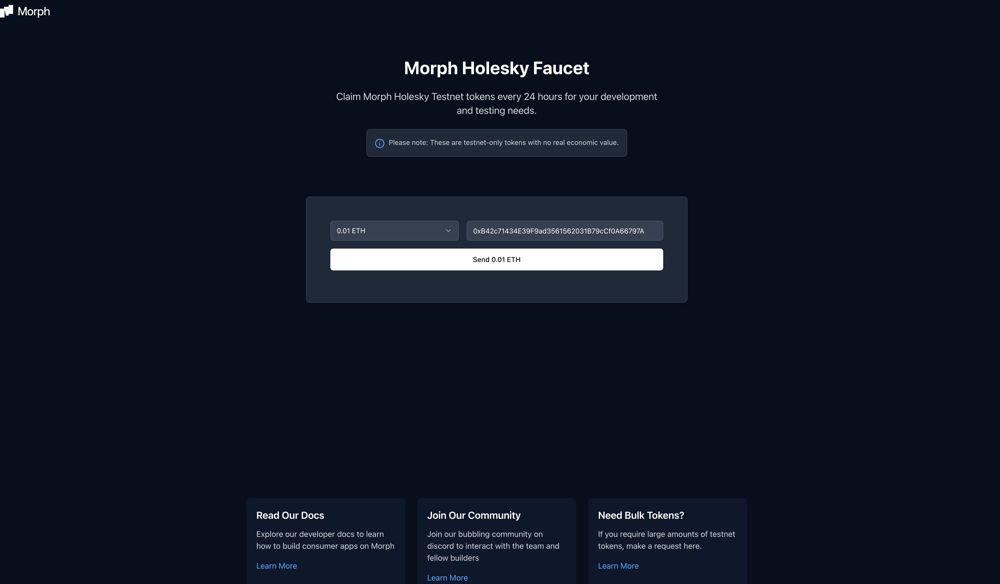

## Faucet

### Faucet du site Morph Holesky

Notre [faucet du site](https://morphfaucet.com/) est en ligne !

Les utilisateurs peuvent réclamer Morph ETH et USDT pour financer leurs activités initiales.

### Faucet ETH Holesky de tiers

Pour utiliser le testnet public de Morph, obtenez de l'ETH de test sur Holesky, puis faites-le passer au testnet Morph.

Voici quelques applications de faucet Holesky :

- https://stakely.io/en/faucet/ethereum-holesky-testnet-eth
- https://faucet.quicknode.com/ethereum/holesky
- https://holesky-faucet.pk910.de/
- https://cloud.google.com/application/web3/faucet/ethereum (nécessite un compte Google)

Une fois que vous recevez de l'ETH sur Holesky, vous devriez le voir dans votre portefeuille sur le réseau Holesky.

Cela peut prendre quelques secondes pour apparaître, mais vous pouvez vérifier l'état en recherchant une transaction vers votre adresse sur l'[Explorateur de blocs Holesky](https://holesky.etherscan.io/).

### Faucet Discord Morph Holesky

### Morph Holesky ETH

Vous pouvez obtenir de l'ETH Morph Holesky sur notre Discord également pour des fins de développement.

En utilisant la commande */morph_eth* et en tapant votre adresse, vous recevrez 0,01 Morph Holesky ETH.

Une fois réussi, vous verrez le message suivant :

### ERC20 USDT

:::tip

Actuellement, nous avons fixé la limite à un seul retrait de tokens par utilisateur Discord toutes les 24 heures.

:::

Vous pouvez obtenir la version USDT de Morph sur Holesky via notre faucet Discord, voici comment cela fonctionne :

1. Rejoignez notre serveur Discord via ce [lien](https://discord.com/invite/L2Morph).

2. Trouvez le canal *#| discord-faucet*.

3. Tapez */faucet* dans le canal et ajoutez votre adresse Holesky derrière.

4. Attendez quelques secondes.

5. Une fois réussi, vous verrez ceci dans le canal.

6. Ajoutez les informations USDT Morph Holesky à votre portefeuille.

~~~markdown
Adresse USDT Ethereum Holesky : "0xD6e9Cd5ef382b0830653d1b2007D5Ca6987FaA26"

Adresse USDT Morph Holesky : "0x9E12AD42c4E4d2acFBADE01a96446e48e6764B98"
~~~

7. Vérifiez votre solde USDT dans le portefeuille et commencez à faire le pont !
